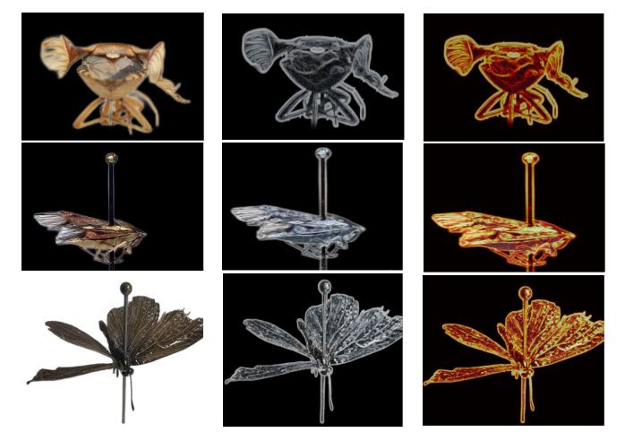
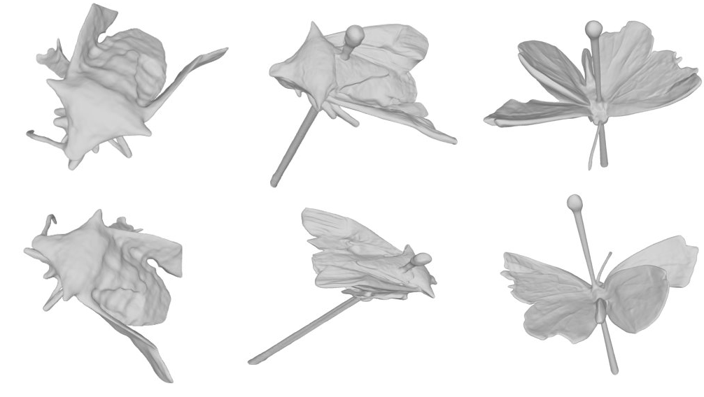

</head>
<body>
  <header>
    <h1>Dynamic Adaptive Sampling for Accurate Image-based 3D Insect Reconstruction</h1>
  </header>

  <nav>
    <ul>
      <li><a href="#introduction">Introduction</a></li>
      <li><a href="#method">Method</a></li>
      <li><a href="#results">Results</a></li>
    </ul>
  </nav>

  <section id="introduction">
    <h2>Introduction</h2>
    
Reconstructing insects from images is challenging due to intricate details like translucent wings and delicate antennae. This project enhances neural implicit surfaces to tackle these complexities effectively.

  </section>

  <section id="method">
    <h2>Method</h2>
    
Our approach leverages thin structure scores to pinpoint critical regions, hybrid ray sampling for efficient coverage, a score-weighted color loss for detail preservation, and adaptive refinement for enhanced accuracy.

    <figure>
      
      <figcaption>Figure 1: Score map computation process</figcaption>
    </figure>
  </section>

  <section id="results">
    <h2>Results</h2>
    
The method demonstrates superior performance over baselines on custom datasets of moths, true bugs, and butterflies, as illustrated below.

    <figure>
      
      <figcaption>Figure 2: Reconstructed meshes comparison</figcaption>
    </figure>
  </section>

  <footer>
    
Submitted to DICTA 2025. For more details, see the full paper upon acceptance.

  </footer>
</body>
</html>
